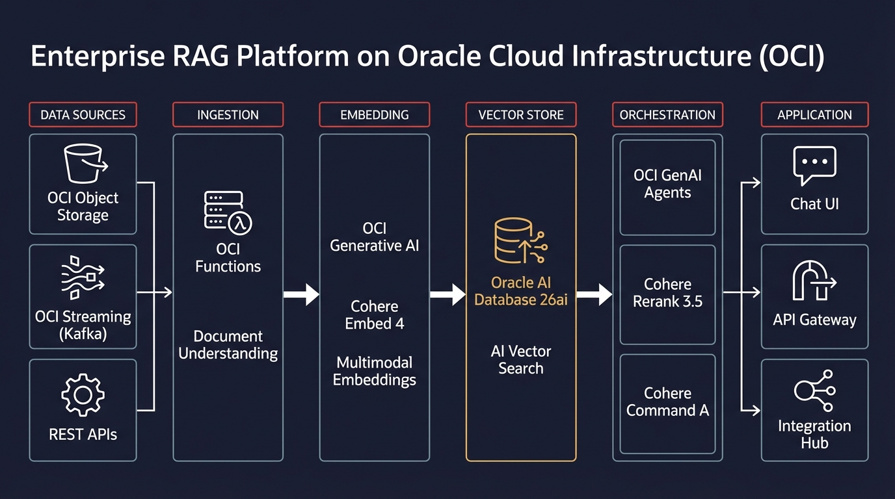
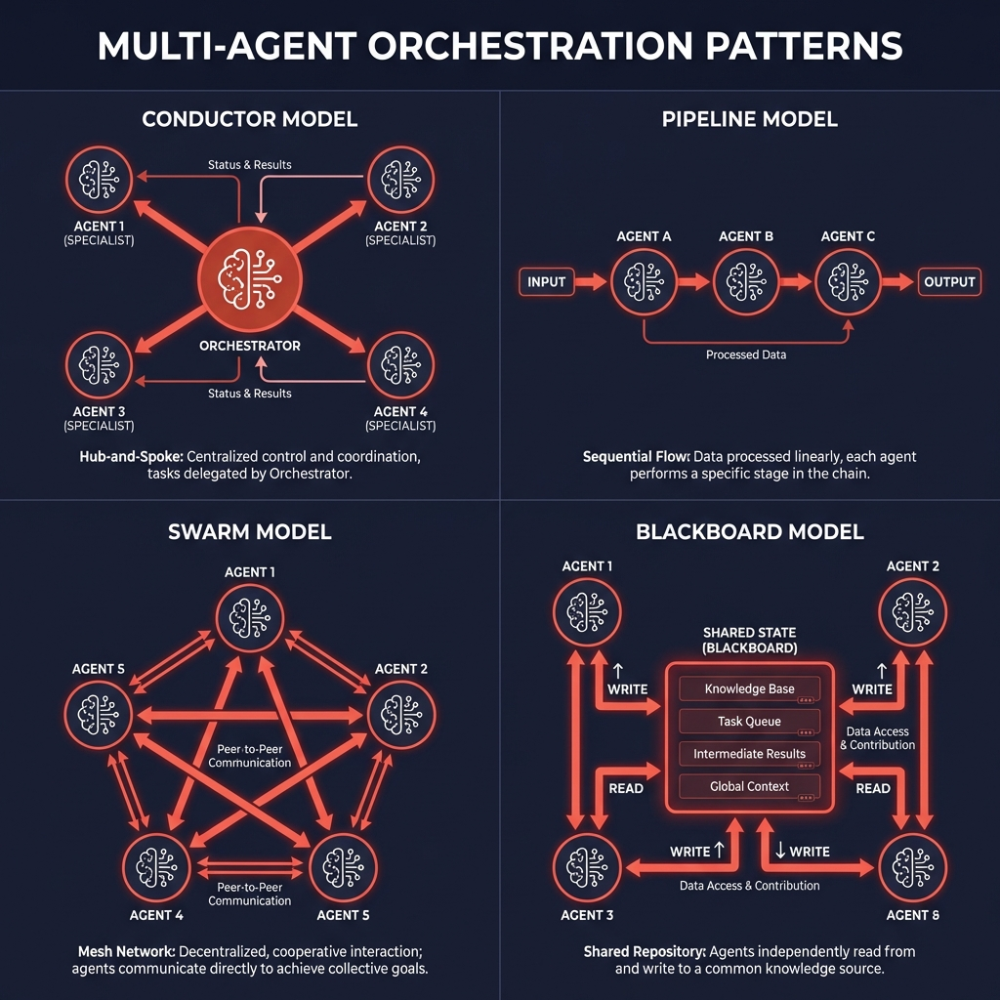

# Claude Code Oracle Skills

> **Disclaimer:** This is an unofficial community project. Not affiliated with, endorsed by, or sponsored by Oracle Corporation. Oracle, OCI, and related marks are trademarks of Oracle Corporation.

<p align="center">
  
</p>

<p align="center">
  <a href="#quick-install"></a>
  <a href="#available-plugins"></a>
  <a href="#slash-commands"></a>
  <a href="LICENSE"></a>
  <a href="https://frankxai.github.io/claude-code-oracle-skills/"></a>
</p>

<p align="center">
  <strong>Production-grade Claude Code skills for Oracle Cloud AI Architects</strong>
</p>

---

## Quick Install

```bash
# Add marketplace
/plugin marketplace add frankxai/claude-code-oracle-skills

# Install all plugins
/plugin install oracle-adk oracle-agent-spec oci-services-expert oracle-ai-architect oracle-diagram-generator oracle-infogenius agentic-orchestration oracle-work-mode
```

## Available Plugins

| Plugin | Command | Description | Difficulty |
|--------|---------|-------------|------------|
| **[oracle-adk](plugins/oracle-adk/)** | `/adk-agent` | Build production agents with Oracle ADK | Intermediate |
| **[oracle-agent-spec](plugins/oracle-agent-spec/)** | `/agent-spec` | Framework-agnostic agent specifications | Intermediate |
| **[oci-services-expert](plugins/oci-services-expert/)** | `/oci-cost` | OCI services, architecture & cost optimization | Beginner |
| **[oracle-ai-architect](plugins/oracle-ai-architect/)** | `/vector-search` | Vector Search, Select AI, NVIDIA NIM | Advanced |
| **[oracle-diagram-generator](plugins/oracle-diagram-generator/)** | `/oci-diagram` | Draw.io, Mermaid, Python diagrams | Beginner |
| **[oracle-infogenius](plugins/oracle-infogenius/)** | `/oracle-infogenius` | AI-generated architecture visuals | Intermediate |
| **[agentic-orchestration](plugins/agentic-orchestration/)** | `/orchestrate` | Multi-agent coordination patterns | Advanced |
| **[oracle-work-mode](plugins/oracle-work-mode/)** | `/oracle-work` | Consulting workflow with confidentiality | Beginner |

## Example Outputs

### Enterprise RAG Platform Architecture

<p align="center">
  
</p>

Generated with:
```bash
/oracle-infogenius "Enterprise RAG Platform with OCI GenAI, Autonomous Database 26ai Vector Search, and Multi-Agent orchestration"
```

### Multi-Agent Orchestration Patterns

<p align="center">
  
</p>

Generated with:
```bash
/orchestrate "customer support automation" --pattern=conductor
```

## Slash Commands

```bash
# Generate OCI architecture diagram
/oci-diagram "rag platform" drawio
/oci-diagram "three-tier web app" mermaid

# Generate AI architecture visuals
/oracle-infogenius "Multi-agent factory for enterprise automation"

# Design multi-agent orchestration
/orchestrate "ETL data pipeline" --pattern=pipeline

# Scaffold Oracle ADK agent
/adk-agent customer-support --type=multi-agent

# Implement vector search
/vector-search "document Q&A system"

# Estimate OCI costs
/oci-cost "RAG platform with 10K daily queries"

# Oracle consulting workflow
/oracle-work              # Activate confidentiality mode
/daily-capture            # Log wins, learnings, blockers
/research "OCI GPU shapes" # Confidential research session
```

## Who Is This For?

<table>
<tr>
<td width="50%">

### AI Architects
All 7 plugins cover the complete AI development lifecycle on Oracle Cloud:
- Agent development (ADK)
- Multi-agent orchestration
- Vector search & RAG
- Professional visuals

</td>
<td width="50%">

### Solution Architects
- **oci-services-expert** - Service selection & patterns
- **oracle-diagram-generator** - Proposal diagrams
- **oracle-infogenius** - Presentation visuals

</td>
</tr>
<tr>
<td>

### Cloud Engineers
- **oci-services-expert** - Infrastructure patterns
- **oracle-ai-architect** - Deployment automation
- Cost optimization strategies

</td>
<td>

### Sales Engineers
- **oracle-infogenius** - Customer-ready visuals
- **oracle-diagram-generator** - Quick architecture diagrams
- Cost estimates for proposals

</td>
</tr>
</table>

## Setup: Official Oracle Icons

**Important**: For Draw.io diagrams, import official Oracle icons first:

1. Download: [OCI-Style-Guide-for-Drawio.zip](https://docs.oracle.com/iaas/Content/Resources/Assets/OCI-Style-Guide-for-Drawio.zip)
2. Extract the ZIP
3. In Draw.io: **File → Open Library From → Device** → select the XML
4. OCI icons appear in left sidebar

Full guide: [plugins/oracle-diagram-generator/ORACLE_ICONS_SETUP.md](plugins/oracle-diagram-generator/ORACLE_ICONS_SETUP.md)

## Quality Standards

Every skill includes:

- **When to Use** - Clear activation triggers at the top
- **Code Examples** - Production-ready, tested patterns
- **Quality Checklist** - 15-20 verification points
- **Decision Framework** - When to use vs. alternatives
- **Official Resources** - Links to Oracle documentation

## Tested With

| Component | Version |
|-----------|---------|
| OCI SDK | 2.130.0 |
| Oracle Database | 26ai |
| Cohere Command | A |
| Cohere Embed | 4 |
| Meta Llama | 4-maverick, 3.3-70b |

## Documentation

- **[GitHub Pages](https://frankxai.github.io/claude-code-oracle-skills/)** - Interactive skill catalog
- **[Skill Catalog](docs/skills.html)** - Filterable plugin list
- **[Diagram Gallery](docs/diagrams.html)** - Architecture examples

## Related Resources

- [Oracle Agent Development Kit](https://docs.oracle.com/en-us/iaas/Content/generative-ai-agents/adk/)
- [Oracle Agent Spec](https://github.com/oracle/agent-spec)
- [OCI Generative AI](https://docs.oracle.com/en-us/iaas/Content/generative-ai/home.htm)
- [OCI Architecture Center](https://docs.oracle.com/en/solutions/)

## Contributing

See [CONTRIBUTING.md](CONTRIBUTING.md) for guidelines.

## License

MIT License - see [LICENSE](LICENSE)

---

<p align="center">
  <strong>Maintained by FrankX</strong> | Oracle AI Architect<br>
  <em>Building the future of enterprise AI on Oracle Cloud</em>
</p>
