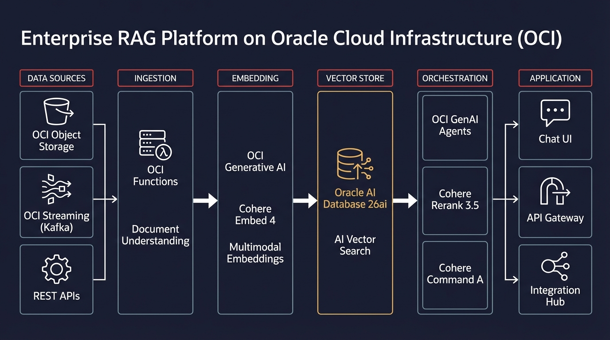
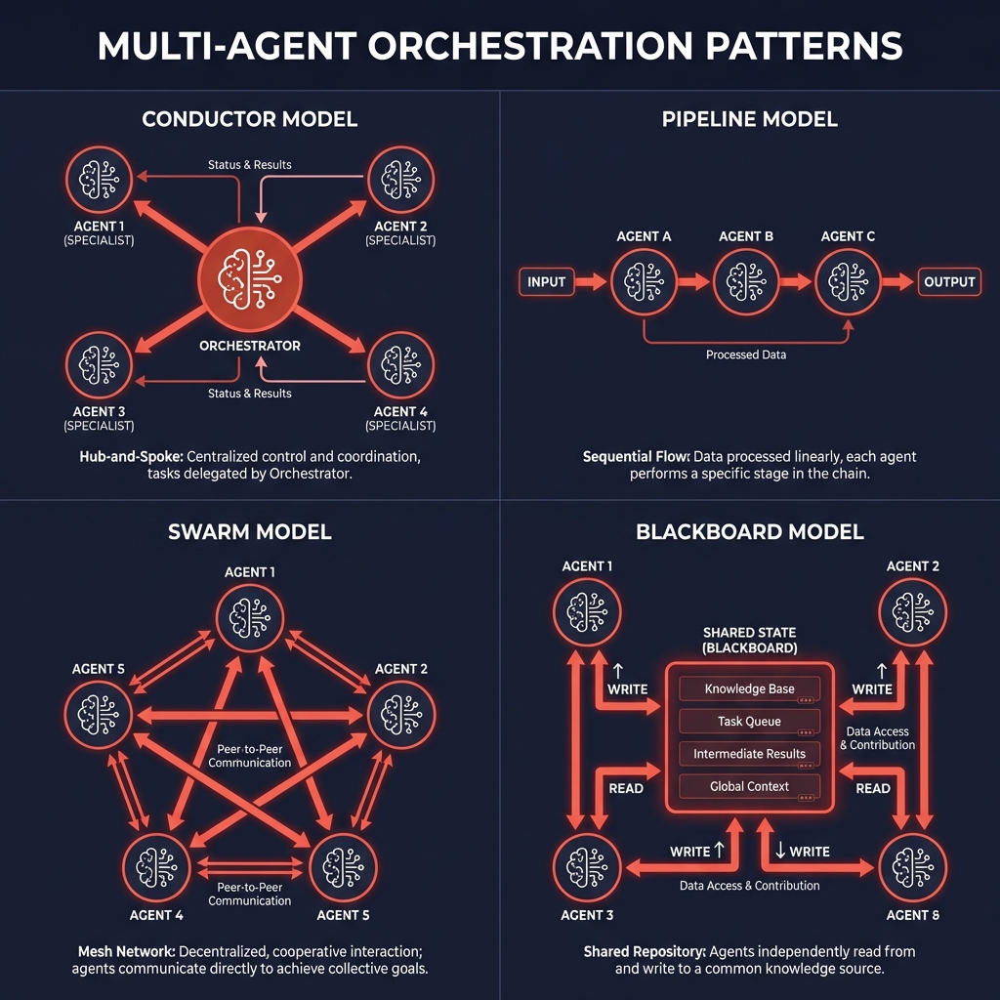

# Claude Code OCI AI Architect Skills


<p align="center">
  
</p>

<p align="center">
  <a href="#quick-install"></a>
  <a href="#available-plugins"></a>
  <a href="#slash-commands"></a>
  <a href="LICENSE"></a>
  <a href="https://frankxai.github.io/claude-code-oracle-skills/"></a>
</p>

<p align="center">
  <strong>Claude Code skills and implementation examples for AI architects working on Oracle Cloud Infrastructure (OCI)</strong>
</p>

---

## Quick Install

```bash
# Add marketplace
/plugin marketplace add frankxai/claude-code-oracle-skills

# Install all plugins
/plugin install oracle-adk oracle-agent-spec oci-services-expert oracle-ai-architect oracle-diagram-generator oracle-infogenius agentic-orchestration oracle-work-mode
```

## Available Plugins

| Plugin | Command | Description | Difficulty |
|--------|---------|-------------|------------|
| **[oracle-adk](plugins/oracle-adk/)** | `/adk-agent` | Agent implementation examples with Oracle ADK | Intermediate |
| **[oracle-agent-spec](plugins/oracle-agent-spec/)** | `/agent-spec` | Framework-agnostic agent specifications | Intermediate |
| **[oci-services-expert](plugins/oci-services-expert/)** | `/oci-cost` | OCI services, architecture & cost optimization | Beginner |
| **[oracle-ai-architect](plugins/oracle-ai-architect/)** | `/vector-search` | Vector Search, Select AI, NVIDIA NIM | Advanced |
| **[oracle-diagram-generator](plugins/oracle-diagram-generator/)** | `/oci-diagram` | Draw.io, Mermaid, Python diagrams | Beginner |
| **[oracle-infogenius](plugins/oracle-infogenius/)** | `/oracle-infogenius` | AI-generated architecture visuals | Intermediate |
| **[oracle-infogenius-flash](skills/oracle-infogenius-flash/)** | `/oracle-infogenius-flash` | Budget visuals ($0.039/image) | Beginner |
| **[oracle-infogenius-pro](skills/oracle-infogenius-pro/)** | `/oracle-infogenius-pro` | Professional visuals ($0.134/image) | Intermediate |
| **[oracle-infogenius-premium](skills/oracle-infogenius-premium/)** | `/oracle-infogenius-premium` | 4K print-ready ($0.24/image) | Intermediate |
| **[agentic-orchestration](plugins/agentic-orchestration/)** | `/orchestrate` | Multi-agent coordination patterns | Advanced |
| **[oracle-work-mode](plugins/oracle-work-mode/)** | `/oracle-work` | Independent OCI learning and research workflow (public or synthetic data only) | Beginner |

## Oracle InfoGenius Tiers

Cost-optimized image generation using Google Gemini models:

| Tier | Command | Cost/Image | Resolution | Best For |
|------|---------|------------|------------|----------|
| **Flash** | `/oracle-infogenius-flash` | $0.039 | 1024px | Drafts, iterations, volume |
| **Pro** | `/oracle-infogenius-pro` | $0.134 | 2048px | Presentations |
| **Premium** | `/oracle-infogenius-premium` | $0.24 | 4096px | Print, large displays |

See [skills/README.md](skills/README.md) for detailed pricing and usage guide.

## Example Outputs

### Enterprise RAG Platform Architecture

<p align="center">
  
</p>

Generated with `/oracle-ai-architect-infogenius`. It shows a 3-tier enterprise architecture:
- **Security & Governance** layer (IAM, Vault, Audit, Data Lineage)
- **Core pipeline**: Data Sources → Processing → Embedding → Vector Store → Retrieval → Generation
- **Observability & Evaluation** layer (Monitoring, Traces, LLM-as-Judge, Feedback Loops)

See [Visual Architecture Patterns Guide](docs/VISUAL-ARCHITECTURE-PATTERNS.md) for design standards.

### Multi-Agent Orchestration Patterns

<p align="center">
  
</p>

Generated with:
```bash
/orchestrate "customer support automation" --pattern=conductor
```

## Slash Commands

```bash
# Generate OCI architecture diagram
/oci-diagram "rag platform" drawio
/oci-diagram "three-tier web app" mermaid

# Generate AI architecture visuals
/oracle-infogenius "Multi-agent factory for enterprise automation"

# Design multi-agent orchestration
/orchestrate "ETL data pipeline" --pattern=pipeline

# Scaffold Oracle ADK agent
/adk-agent customer-support --type=multi-agent

# Implement vector search
/vector-search "document Q&A system"

# Estimate OCI costs
/oci-cost "RAG platform with 10K daily queries"

# Independent OCI learning workflow (public or synthetic data only)
/oracle-work              # Start a study session
/daily-capture            # Log what you built, learned or got stuck on
/research "OCI GPU shapes" # Source-backed research from public documentation
```

## Who Is This For?

<table>
<tr>
<td width="50%">

### AI Architects
All 7 plugins cover the complete AI development lifecycle on Oracle Cloud:
- Agent development (ADK)
- Multi-agent orchestration
- Vector search & RAG
- Professional visuals

</td>
<td width="50%">

### Solution Architects
- **oci-services-expert** - Service selection & patterns
- **oracle-diagram-generator** - Proposal diagrams
- **oracle-infogenius** - Presentation visuals

</td>
</tr>
<tr>
<td>

### Cloud Engineers
- **oci-services-expert** - Infrastructure patterns
- **oracle-ai-architect** - Deployment automation
- Cost optimization strategies

</td>
<td>

### Sales Engineers
- **oracle-infogenius** - Presentation-ready visuals
- **oracle-diagram-generator** - Quick architecture diagrams
- Cost estimates for proposals

</td>
</tr>
</table>

## Setup: Official Oracle Icons

**Important**: For Draw.io diagrams, import official Oracle icons first:

1. Download: [OCI-Style-Guide-for-Drawio.zip](https://docs.oracle.com/en-us/iaas/Content/Resources/Assets/OCI-Style-Guide-for-Drawio.zip)
2. Extract the ZIP
3. In Draw.io: **File → Open Library From → Device** → select the XML
4. OCI icons appear in left sidebar

Full guide: [plugins/oracle-diagram-generator/ORACLE_ICONS_SETUP.md](plugins/oracle-diagram-generator/ORACLE_ICONS_SETUP.md)

## Quality Standards

Every skill includes:

- **When to Use** - Clear activation triggers at the top
- **Code Examples** - Implementation examples to adapt and test in your own tenancy
- **Quality Checklist** - 15-20 verification points
- **Decision Framework** - When to use vs. alternatives
- **Official Resources** - Links to Oracle documentation

## Target Versions

The examples were written against these versions. They have not been re-run for this revision.

| Component | Version |
|-----------|---------|
| OCI SDK | 2.130.0 |
| Oracle AI Database | 26ai |
| Cohere Command | A |
| Cohere Embed | 4 |
| Meta Llama | 4-maverick, 3.3-70b |

## Documentation

- **[AI Architect Toolkit Guide](docs/AI-ARCHITECT-TOOLKIT-GUIDE.md)** - Complete workflow: Idea to Working Prototype (8 phases, prompts, ADB MCP setup)
- **[GitHub Pages](https://frankxai.github.io/claude-code-oracle-skills/)** - Interactive skill catalog
- **[Skill Catalog](docs/skills.html)** - Filterable plugin list
- **[Diagram Gallery](docs/diagrams.html)** - Architecture examples
- **[Skill Management Guide](docs/SKILL_MANAGEMENT.md)** - How to organize and maintain skills

## Related Resources

- [Oracle Agent Development Kit](https://docs.oracle.com/en-us/iaas/Content/generative-ai-agents/adk/api-reference/introduction.htm)
- [Oracle Agent Spec](https://github.com/oracle/agent-spec)
- [OCI Generative AI](https://docs.oracle.com/en-us/iaas/Content/generative-ai/home.htm)
- [OCI Architecture Center](https://docs.oracle.com/solutions/)

## Contributing

See [CONTRIBUTING.md](CONTRIBUTING.md) for guidelines.


## Disclaimer
> **Disclaimer:** Unofficial community project. Not affiliated with, endorsed by, or sponsored by Oracle Corporation. Oracle and OCI are trademarks or registered trademarks of Oracle Corporation. Other names are marks of their respective owners.

## License

MIT License - see [LICENSE](LICENSE)

---

<p align="center">
  <strong>Maintained by FrankX</strong> as an independent community project
</p>


