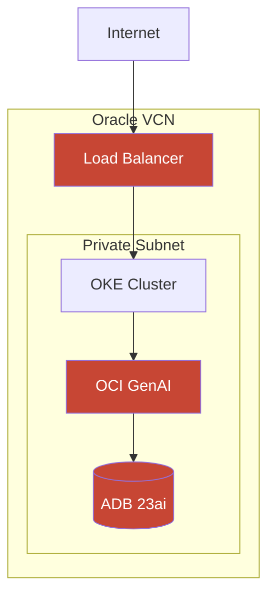

# OCI Diagram Best Practices

## What Makes a Good OCI Architecture Diagram

### GOOD Diagram Characteristics (like "OCI AI Factory Arch.drawio")

1. **Uses Official OCI Stencils**
   - Icons from `OCI Library.xml` with `shape=stencil(...)` format
   - Consistent visual language across all components
   - Proper Oracle brand colors (#2d5967 teal, #C74634 red)

2. **Clear Layered Architecture**
   - Logical grouping (Compute, Database, AI, Networking)
   - Clear boundaries (VCN, Subnets, Regions)
   - Proper containment hierarchy

3. **Professional Styling**
   - Light background (white or very light gray)
   - Clean lines and connections
   - Consistent sizing and spacing
   - Readable labels

### BAD Diagram Characteristics (like "marketing-automation-agent-v2.drawio")

1. **Uses Emojis Instead of Icons** ❌
   ```
   ⚡ 🗄️ 🔷 📁 🎯 🧠 ✍️ 📊 📱 💬
   ```
   - Unprofessional appearance
   - Inconsistent with Oracle brand
   - Not suitable for customer-facing materials

2. **Dark Theme Styling** ❌
   - `background="#0D1117"` (dark background)
   - Hard to print
   - Doesn't match Oracle documentation style

3. **Generic Rectangles** ❌
   ```xml
   style="rounded=1;whiteSpace=wrap;html=1;fillColor=#7c2d12"
   ```
   - No visual distinction between service types
   - Looks like generic marketing material, not architecture

---

## The Reality: Claude Cannot Directly Use OCI Icons

**Important Understanding:**

The official OCI icons are stored as encoded stencils in `OCI Library.xml`. Each icon is a base64-encoded SVG path like:

```xml
shape=stencil(nZBLDoAgDERP0z3SIyjew0SURgSD+Lu9kMZoXLhwN9O+...)
```

Claude CANNOT:
- Generate these encoded stencil paths (they're binary-encoded)
- Reference icons by name (there's no `mxgraph.oci.compute_vm`)
- Create pixel-perfect icons from scratch

### What Claude CAN Do

1. **Generate Diagram Structure**
   - Proper layout and grouping
   - Correct sizing and positioning
   - Connection logic and data flow

2. **Use Text-Based Representations**
   - ASCII diagrams for quick visualization
   - Mermaid.js for documentation
   - Python diagrams library (has built-in OCI icons)

3. **Create Diagram Templates**
   - Generate Draw.io XML with placeholders
   - User manually drags official icons from library
   - Hybrid approach: structure from Claude, icons from library

---

## Recommended Workflow for High-Quality Diagrams

### Option 1: Python Diagrams (Best for Claude-Generated)

The Python `diagrams` library has OCI icons built-in:

```python
from diagrams import Diagram, Cluster
from diagrams.oci.compute import VM, Container
from diagrams.oci.database import AutonomousDatabase
from diagrams.oci.network import LoadBalancer, Vcn
from diagrams.oci.ai import AIService

with Diagram("OCI AI Platform", show=False, direction="TB"):
    with Cluster("VCN"):
        lb = LoadBalancer("Load Balancer")

        with Cluster("Application Tier"):
            apps = [Container("App-1"), Container("App-2")]

        with Cluster("AI Tier"):
            ai = AIService("GenAI Service")

        with Cluster("Data Tier"):
            db = AutonomousDatabase("ADB 23ai")

    lb >> apps >> ai >> db
```

**Output**: PNG/SVG with proper OCI icons.

### Option 2: Draw.io Template + Manual Icons

1. Claude generates structure XML:
```xml
<mxCell id="compute-placeholder" value="[DRAG OCI VM HERE]"
        style="rounded=1;dashed=1;fillColor=#f5f5f5"
        vertex="1" parent="1">
  <mxGeometry x="100" y="200" width="80" height="80" as="geometry" />
</mxCell>
```

2. User opens in Draw.io
3. User drags icons from OCI Library sidebar
4. Replaces placeholders with real icons

### Option 3: Mermaid.js (Best for Documentation)



---

## Official Oracle Colors

Use these consistently:

| Color | Hex | Usage |
|-------|-----|-------|
| Oracle Red | `#C74634` | Primary brand, service icons |
| Oracle Red Dark | `#8B2500` | Hover states, emphasis |
| OCI Teal | `#2d5967` | Secondary elements |
| Oracle Black | `#312D2A` | Text, lines |
| Oracle Gray | `#9e9892` | Borders, secondary lines |
| Light Gray | `#f5f4f2` | Backgrounds |

---

## What User Should Do After Claude Generates Template

1. **Save the XML file** as `.drawio`
2. **Open in Draw.io** (app.diagrams.net or desktop app)
3. **Import OCI Library**: File → Open Library From → Device → select `OCI Library.xml`
4. **Replace placeholders**: Drag official icons from sidebar
5. **Adjust positioning** as needed
6. **Export** as PNG/SVG/PDF

---

## Quality Checklist for Diagrams

### Structure
- [ ] Clear title stating the architecture purpose
- [ ] Logical layers (Ingestion → Processing → Storage → Application)
- [ ] Proper containment (VCN → Subnet → Resources)
- [ ] Data flow direction indicated with arrows

### Visual
- [ ] Uses official OCI icons OR Python diagrams library
- [ ] Light background (white or #f5f4f2)
- [ ] Consistent spacing (use grid)
- [ ] Labels are readable (min 10pt font)
- [ ] Oracle Red (#C74634) for OCI services

### Content
- [ ] All OCI services correctly named
- [ ] Connections make logical sense
- [ ] Security boundaries shown (VCN, subnets)
- [ ] No proprietary customer information

### Export
- [ ] Exportable format (PNG, SVG, PDF)
- [ ] Resolution suitable for presentations (1920x1080 min)
- [ ] Print-friendly (light background, dark text)

---

## Summary: The Truth About Claude and OCI Diagrams

| What Claude Outputs | Quality Level | Use Case |
|---------------------|---------------|----------|
| Python `diagrams` code | ⭐⭐⭐⭐⭐ HIGH | Best automated option |
| Mermaid.js | ⭐⭐⭐⭐ GOOD | Documentation, quick visualization |
| Draw.io template (no icons) | ⭐⭐⭐ MEDIUM | Structure only, user adds icons |
| Draw.io with emojis | ⭐ LOW | Not recommended for professional use |
| ASCII art | ⭐⭐⭐ MEDIUM | Quick sketches, planning |

**Recommendation**: Use Python diagrams for automated professional output, or create Draw.io templates where users add official icons manually.
