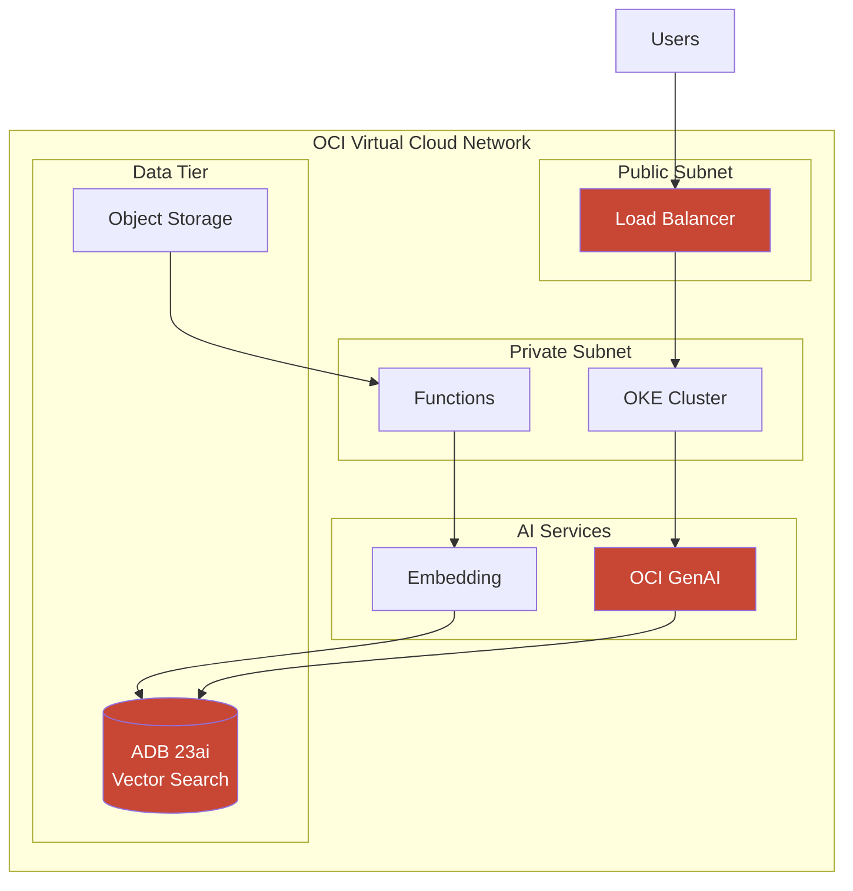
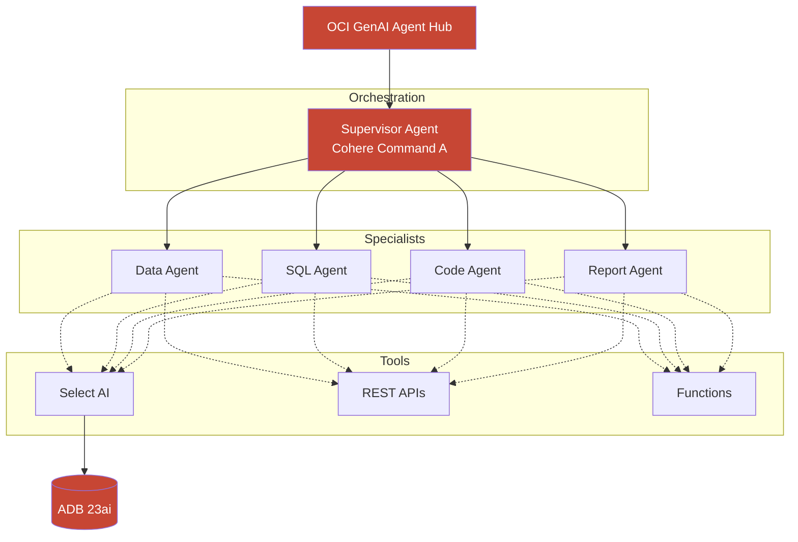

# Oracle Diagram Generator - Complete Reference

## Purpose

Generate professional, accurate OCI architecture diagrams using official Oracle icons and styling.

---

## CRITICAL: Understanding Icon Limitations

**The Truth About OCI Icons in Draw.io:**

Official OCI icons are stored as encoded stencils in `OCI Library.xml`:
```xml
shape=stencil(nZBLDoAgDERP0z3SIyjew0SURgSD...)  <!-- Base64 encoded SVG -->
```

**What Claude CANNOT Do:**
- Generate these encoded stencil paths (binary format)
- Reference icons by name like `mxgraph.oci.compute_vm` (doesn't exist)
- Create pixel-perfect official icons programmatically

**What Claude CAN Do:**
- Generate Python `diagrams` code (HAS built-in OCI icons)
- Create Mermaid.js diagrams (good for documentation)
- Generate Draw.io XML structure (user adds icons manually)
- Create ASCII diagrams for quick visualization

---

## Recommended Approach by Use Case

| Use Case | Best Method | Quality |
|----------|-------------|---------|
| Customer presentations | Python diagrams → PNG | ⭐⭐⭐⭐⭐ |
| Documentation/README | Mermaid.js | ⭐⭐⭐⭐ |
| Interactive editing | Draw.io template + manual icons | ⭐⭐⭐⭐ |
| Quick planning | ASCII art | ⭐⭐⭐ |
| DON'T USE | Draw.io with emojis | ⭐ |

---

## Method 1: Python Diagrams (Recommended)

The `diagrams` library has official OCI icons built-in.

### Installation
```bash
pip install diagrams
# Requires Graphviz:
brew install graphviz  # macOS
apt install graphviz   # Linux
```

### Available OCI Icons

```python
# Compute
from diagrams.oci.compute import VM, BM, Container, OKE, Functions, InstancePools

# Database
from diagrams.oci.database import Autonomous, DatabaseService, Dcat

# Network
from diagrams.oci.network import LoadBalancer, Vcn, InternetGateway, ServiceGateway, Drg

# Storage
from diagrams.oci.storage import ObjectStorage, BlockStorage, FileStorage

# Security
from diagrams.oci.security import Vault, CloudGuard, IDCloud

# Monitoring
from diagrams.oci.monitoring import Telemetry, Events, Notifications, Alarm

# DevOps
from diagrams.oci.devops import ResourceManager
```

### Complete Example: Enterprise RAG Platform

```python
from diagrams import Diagram, Cluster, Edge
from diagrams.oci.compute import Container, Functions
from diagrams.oci.database import Autonomous
from diagrams.oci.network import LoadBalancer, InternetGateway
from diagrams.oci.storage import ObjectStorage
from diagrams.oci.security import Vault
from diagrams.generic.compute import Rack
from diagrams.onprem.client import Users

graph_attr = {
    "bgcolor": "#FFFFFF",
    "fontcolor": "#312D2A",
    "splines": "ortho",
    "dpi": "150"
}

with Diagram("OCI Enterprise RAG Platform", show=False, direction="TB",
             graph_attr=graph_attr, outformat="png"):

    users = Users("Users")

    with Cluster("OCI Region"):
        igw = InternetGateway("IGW")
        lb = LoadBalancer("LB")

        with Cluster("Application Tier"):
            apps = [Container("Chat UI"), Container("RAG API")]

        with Cluster("AI Tier"):
            genai = Rack("OCI GenAI\\nCohere Command A")
            embed = Rack("OCI GenAI\\nCohere Embed 4")

        with Cluster("Data Tier"):
            adb = Autonomous("ADB 23ai\\nVector Search")
            storage = ObjectStorage("Documents")

        vault = Vault("Secrets")

    users >> igw >> lb >> apps
    apps[1] >> Edge(color="#C74634") >> genai
    apps[1] >> Edge(color="#C74634") >> adb
    storage >> embed >> adb
```

---

## Method 2: Mermaid.js (Documentation)

Good for embedding in Markdown documentation.

### RAG Architecture


### Agent Orchestration


---

## Method 3: Draw.io Template (User Adds Icons)

Generate structure, user drags official icons from OCI Library.

### Template Structure
```xml
<mxfile host="app.diagrams.net">
  <diagram name="OCI Architecture" id="arch-001">
    <mxGraphModel dx="1200" dy="800" grid="1" gridSize="10">
      <root>
        <mxCell id="0" />
        <mxCell id="1" parent="0" />

        <!-- Title -->
        <mxCell id="title" value="OCI Enterprise Platform"
                style="text;fontSize=24;fontStyle=1;fontColor=#312D2A"
                vertex="1" parent="1">
          <mxGeometry x="40" y="20" width="400" height="40" />
        </mxCell>

        <!-- VCN Container -->
        <mxCell id="vcn" value="Virtual Cloud Network (VCN)"
                style="rounded=1;dashed=1;fillColor=#f5f4f2;strokeColor=#C74634;strokeWidth=2"
                vertex="1" parent="1">
          <mxGeometry x="40" y="80" width="800" height="500" />
        </mxCell>

        <!-- PLACEHOLDER: Drag OCI Load Balancer icon here -->
        <mxCell id="lb-placeholder" value="[DRAG: Load Balancer]"
                style="rounded=1;dashed=1;fillColor=#fff5f3;strokeColor=#C74634"
                vertex="1" parent="1">
          <mxGeometry x="100" y="120" width="80" height="80" />
        </mxCell>

        <!-- PLACEHOLDER: Drag OCI Autonomous Database icon here -->
        <mxCell id="adb-placeholder" value="[DRAG: Autonomous DB]"
                style="rounded=1;dashed=1;fillColor=#fff5f3;strokeColor=#C74634"
                vertex="1" parent="1">
          <mxGeometry x="400" y="400" width="80" height="80" />
        </mxCell>

      </root>
    </mxGraphModel>
  </diagram>
</mxfile>
```

**User Workflow:**
1. Save XML as `.drawio`
2. Open in Draw.io
3. Import OCI Library: File → Open Library From → Device → `OCI Library.xml`
4. Drag official icons to replace placeholders
5. Adjust and export

---

## Official Oracle Colors

| Color | Hex | CSS Variable | Usage |
|-------|-----|--------------|-------|
| Oracle Red | `#C74634` | `--oracle-red` | Primary brand, icons |
| Oracle Red Dark | `#8B2500` | `--oracle-red-dark` | Emphasis |
| OCI Teal | `#2d5967` | `--oci-teal` | Secondary elements |
| Oracle Black | `#312D2A` | `--oracle-black` | Text, lines |
| Oracle Gray | `#9e9892` | `--oracle-gray` | Borders |
| Background | `#f5f4f2` | `--oracle-bg` | Containers |
| White | `#FFFFFF` | | Canvas background |

---

## What NOT To Do

### ❌ Don't Use Emojis as Icons
```xml
<!-- BAD -->
<mxCell value="🗄️" style="text;fontSize=24" />
<mxCell value="⚡" style="text;fontSize=24" />
```

### ❌ Don't Use Dark Backgrounds
```xml
<!-- BAD -->
<mxGraphModel background="#0D1117">
```

### ❌ Don't Claim Non-Existent Shape Names
```xml
<!-- BAD - These don't exist in Draw.io -->
shape=mxgraph.oci.compute_vm
shape=mxgraph.oci.autonomous_database
```

### ❌ Don't Use Generic Rectangles for OCI Services
```xml
<!-- BAD -->
<mxCell value="ATP" style="rounded=1;fillColor=#C74634" />
```

---

## Quality Checklist

### Before Generating
- [ ] Determined the best output format (Python/Mermaid/Template)
- [ ] Understood user's end goal (presentation/documentation/planning)

### Structure
- [ ] Clear title stating architecture purpose
- [ ] Logical layers (top-to-bottom or left-to-right flow)
- [ ] Proper containment (VCN → Subnet → Resources)
- [ ] Data flow direction indicated

### Visual (for Python/final output)
- [ ] White or light background (#FFFFFF or #f5f4f2)
- [ ] Oracle Red (#C74634) for OCI services
- [ ] Consistent sizing and spacing
- [ ] Readable labels (min 10pt)

### Content
- [ ] All OCI services correctly named
- [ ] Connections make logical sense
- [ ] No proprietary customer information

---

## Setup Guide

### Python Diagrams Setup
```bash
pip install diagrams
# Install Graphviz
brew install graphviz  # macOS
apt install graphviz   # Linux
choco install graphviz # Windows
```

### Draw.io OCI Library Setup
1. Download: [OCI-Style-Guide-for-Drawio.zip](https://docs.oracle.com/iaas/Content/Resources/Assets/OCI-Style-Guide-for-Drawio.zip)
2. Extract ZIP
3. In Draw.io: File → Open Library From → Device → `OCI Library.xml`
4. Icons appear in left sidebar under "OCI"

---

## Resources

- [OCI Architecture Diagram Toolkits](https://docs.oracle.com/en-us/iaas/Content/General/Reference/graphicsfordiagrams.htm)
- [Python Diagrams Library](https://diagrams.mingrammer.com/)
- [Python Diagrams OCI Provider](https://diagrams.mingrammer.com/docs/nodes/oci)
- [OCI Architecture Center](https://docs.oracle.com/en/solutions/)
- [Mermaid.js Documentation](https://mermaid.js.org/)

---

*Version 2.0.0 - Corrected icon approach, added Python diagrams as primary method*
