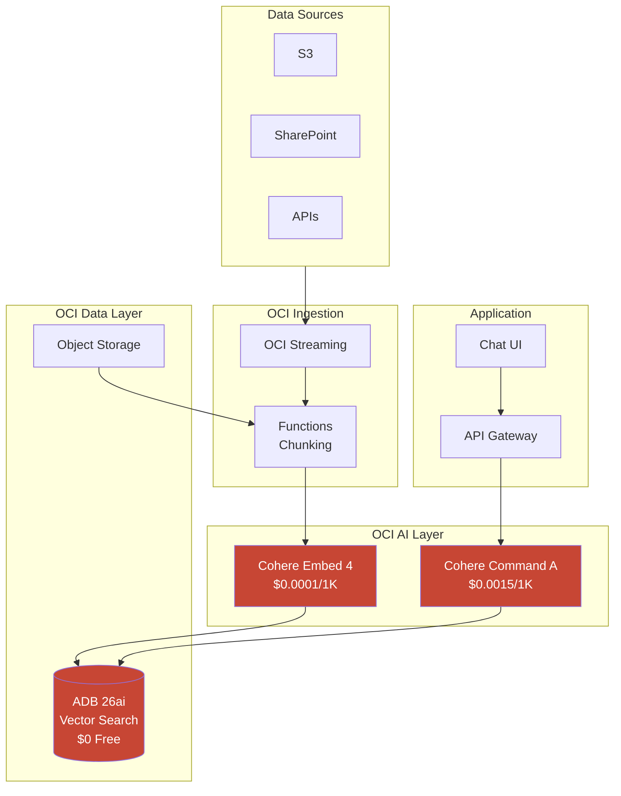
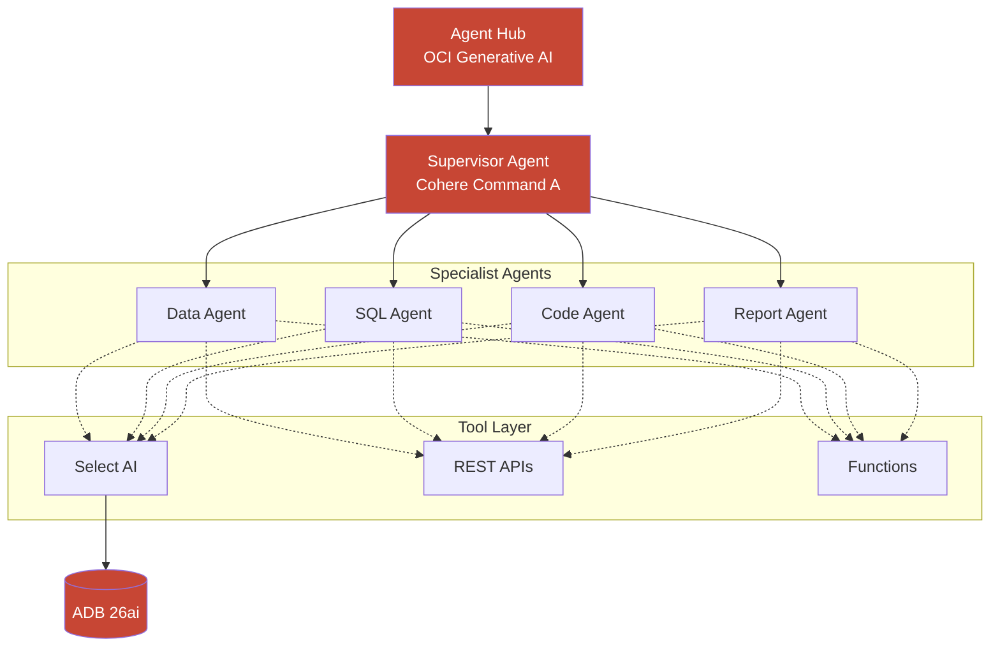

# Oracle Diagram Generator - Complete Reference

## Purpose
Generate professional, accurate OCI architecture diagrams using official Oracle icons and styling. Supports Draw.io XML templates, Python diagrams library, and Mermaid.js for various output formats and workflows.

## Official Oracle Icon Library

### Download Sources
- **Primary**: https://docs.oracle.com/en-us/iaas/Content/General/Reference/graphicsfordiagrams.htm
- **Draw.io Library**: Download XML and import via File → Open Library From
- **GitHub**: https://github.com/oracle-quickstart/oci-arch-template

---

## Complete Draw.io OCI Shape Reference

### Compute Services
```
mxgraph.oci.compute_vm           - Virtual Machine
mxgraph.oci.compute_bm           - Bare Metal
mxgraph.oci.container_engine     - OKE (Kubernetes)
mxgraph.oci.container_instance   - Container Instance
mxgraph.oci.functions            - Functions (Serverless)
mxgraph.oci.instance_pool        - Instance Pool
mxgraph.oci.autoscaling          - Autoscaling Configuration
```

### Database Services
```
mxgraph.oci.autonomous_database  - Autonomous Database (ATP/ADW/AJD)
mxgraph.oci.database_system      - DB System (VM/BM)
mxgraph.oci.exadata              - Exadata Cloud Service
mxgraph.oci.mysql                - MySQL HeatWave
mxgraph.oci.nosql                - NoSQL Database
```

### AI & Machine Learning
```
mxgraph.oci.generative_ai        - OCI Generative AI
mxgraph.oci.data_science         - Data Science Platform
mxgraph.oci.ai_vision            - AI Vision
mxgraph.oci.ai_language          - AI Language
mxgraph.oci.ai_speech            - AI Speech
mxgraph.oci.ai_document          - Document Understanding
mxgraph.oci.anomaly_detection    - Anomaly Detection
```

### Storage Services
```
mxgraph.oci.object_storage       - Object Storage
mxgraph.oci.block_storage        - Block Volume
mxgraph.oci.file_storage         - File Storage (NFS)
mxgraph.oci.archive_storage      - Archive Storage
```

### Networking Services
```
mxgraph.oci.vcn                  - Virtual Cloud Network
mxgraph.oci.subnet               - Subnet
mxgraph.oci.load_balancer        - Load Balancer (L7)
mxgraph.oci.network_load_balancer - Network Load Balancer (L4)
mxgraph.oci.api_gateway          - API Gateway
mxgraph.oci.fastconnect          - FastConnect
mxgraph.oci.drg                  - Dynamic Routing Gateway
mxgraph.oci.nat_gateway          - NAT Gateway
mxgraph.oci.internet_gateway     - Internet Gateway
mxgraph.oci.service_gateway      - Service Gateway
mxgraph.oci.waf                  - Web Application Firewall
```

### Integration & Streaming
```
mxgraph.oci.streaming            - Streaming (Kafka)
mxgraph.oci.integration          - Integration Cloud
mxgraph.oci.events               - Events Service
mxgraph.oci.notifications        - Notifications
mxgraph.oci.queue                - Queue Service
```

### Security & Identity
```
mxgraph.oci.iam                  - IAM
mxgraph.oci.vault                - Vault (KMS)
mxgraph.oci.bastion              - Bastion Service
mxgraph.oci.cloud_guard          - Cloud Guard
mxgraph.oci.data_safe            - Data Safe
```

### DevOps & Management
```
mxgraph.oci.devops               - DevOps Service
mxgraph.oci.resource_manager     - Resource Manager (Terraform)
mxgraph.oci.logging              - Logging Service
mxgraph.oci.monitoring           - Monitoring
mxgraph.oci.apm                  - APM (Application Performance)
```

---

## Draw.io XML Templates

### Template 1: Basic Three-Tier Architecture

```xml
<mxfile host="app.diagrams.net" modified="2026-01-21T00:00:00.000Z" agent="OCI Diagram Generator" version="21.0.0">
  <diagram id="three-tier" name="Three-Tier Web App">
    <mxGraphModel dx="1422" dy="794" grid="1" gridSize="10" guides="1" tooltips="1" connect="1" arrows="1" fold="1" page="1" pageScale="1" pageWidth="1169" pageHeight="827" math="0" shadow="0">
      <root>
        <mxCell id="0" />
        <mxCell id="1" parent="0" />

        <!-- Title -->
        <mxCell id="title" value="OCI Three-Tier Web Application" style="text;html=1;strokeColor=none;fillColor=none;align=center;verticalAlign=middle;whiteSpace=wrap;rounded=0;fontSize=24;fontStyle=1;fontColor=#312D2A;" vertex="1" parent="1">
          <mxGeometry x="384" y="20" width="400" height="40" as="geometry" />
        </mxCell>

        <!-- Internet -->
        <mxCell id="internet" value="Internet" style="ellipse;shape=cloud;whiteSpace=wrap;html=1;fillColor=#E6E6E6;strokeColor=#312D2A;" vertex="1" parent="1">
          <mxGeometry x="534" y="80" width="100" height="60" as="geometry" />
        </mxCell>

        <!-- VCN Container -->
        <mxCell id="vcn" value="Virtual Cloud Network (VCN)" style="rounded=1;whiteSpace=wrap;html=1;fillColor=#FFF5F3;strokeColor=#C74634;strokeWidth=2;dashed=1;verticalAlign=top;fontStyle=1;fontSize=14;fontColor=#C74634;spacingTop=10;" vertex="1" parent="1">
          <mxGeometry x="200" y="180" width="768" height="500" as="geometry" />
        </mxCell>

        <!-- Public Subnet -->
        <mxCell id="public-subnet" value="Public Subnet" style="rounded=1;whiteSpace=wrap;html=1;fillColor=#E8F5E9;strokeColor=#1E8E3E;strokeWidth=1;dashed=1;verticalAlign=top;fontStyle=1;fontSize=12;fontColor=#1E8E3E;" vertex="1" parent="1">
          <mxGeometry x="220" y="220" width="300" height="200" as="geometry" />
        </mxCell>

        <!-- Private Subnet -->
        <mxCell id="private-subnet" value="Private Subnet" style="rounded=1;whiteSpace=wrap;html=1;fillColor=#FFF3E0;strokeColor=#F9A825;strokeWidth=1;dashed=1;verticalAlign=top;fontStyle=1;fontSize=12;fontColor=#F9A825;" vertex="1" parent="1">
          <mxGeometry x="550" y="220" width="400" height="440" as="geometry" />
        </mxCell>

        <!-- Load Balancer -->
        <mxCell id="lb" value="Load Balancer" style="shape=mxgraph.oci.load_balancer;verticalLabelPosition=bottom;verticalAlign=top;fillColor=#C74634;strokeColor=none;" vertex="1" parent="1">
          <mxGeometry x="345" y="280" width="50" height="50" as="geometry" />
        </mxCell>

        <!-- Compute Instance Pool -->
        <mxCell id="compute-cluster" value="Instance Pool (Auto-scaling)" style="rounded=1;whiteSpace=wrap;html=1;fillColor=#FFFFFF;strokeColor=#312D2A;verticalAlign=top;fontStyle=1;fontSize=11;" vertex="1" parent="1">
          <mxGeometry x="580" y="260" width="180" height="120" as="geometry" />
        </mxCell>

        <!-- VM 1 -->
        <mxCell id="vm1" value="VM-1" style="shape=mxgraph.oci.compute_vm;verticalLabelPosition=bottom;verticalAlign=top;fillColor=#C74634;strokeColor=none;" vertex="1" parent="1">
          <mxGeometry x="600" y="300" width="45" height="45" as="geometry" />
        </mxCell>

        <!-- VM 2 -->
        <mxCell id="vm2" value="VM-2" style="shape=mxgraph.oci.compute_vm;verticalLabelPosition=bottom;verticalAlign=top;fillColor=#C74634;strokeColor=none;" vertex="1" parent="1">
          <mxGeometry x="695" y="300" width="45" height="45" as="geometry" />
        </mxCell>

        <!-- Autonomous Database -->
        <mxCell id="adb" value="Autonomous&#xa;Database 26ai" style="shape=mxgraph.oci.autonomous_database;verticalLabelPosition=bottom;verticalAlign=top;fillColor=#C74634;strokeColor=none;" vertex="1" parent="1">
          <mxGeometry x="720" y="450" width="60" height="60" as="geometry" />
        </mxCell>

        <!-- Object Storage -->
        <mxCell id="storage" value="Object&#xa;Storage" style="shape=mxgraph.oci.object_storage;verticalLabelPosition=bottom;verticalAlign=top;fillColor=#C74634;strokeColor=none;" vertex="1" parent="1">
          <mxGeometry x="600" y="550" width="50" height="50" as="geometry" />
        </mxCell>

        <!-- Connections -->
        <mxCell id="conn1" style="edgeStyle=orthogonalEdgeStyle;rounded=0;orthogonalLoop=1;jettySize=auto;html=1;strokeColor=#312D2A;strokeWidth=2;" edge="1" parent="1" source="internet" target="lb">
          <mxGeometry relative="1" as="geometry" />
        </mxCell>

        <mxCell id="conn2" style="edgeStyle=orthogonalEdgeStyle;rounded=0;orthogonalLoop=1;jettySize=auto;html=1;strokeColor=#312D2A;strokeWidth=2;" edge="1" parent="1" source="lb" target="compute-cluster">
          <mxGeometry relative="1" as="geometry" />
        </mxCell>

        <mxCell id="conn3" style="edgeStyle=orthogonalEdgeStyle;rounded=0;orthogonalLoop=1;jettySize=auto;html=1;strokeColor=#312D2A;strokeWidth=2;" edge="1" parent="1" source="compute-cluster" target="adb">
          <mxGeometry relative="1" as="geometry" />
        </mxCell>

        <mxCell id="conn4" style="edgeStyle=orthogonalEdgeStyle;rounded=0;orthogonalLoop=1;jettySize=auto;html=1;strokeColor=#312D2A;strokeWidth=1;dashed=1;" edge="1" parent="1" source="compute-cluster" target="storage">
          <mxGeometry relative="1" as="geometry" />
        </mxCell>

        <!-- Cost Annotation -->
        <mxCell id="cost" value="💰 Estimated: $50-200/mo" style="text;html=1;strokeColor=none;fillColor=#FFF9C4;align=center;verticalAlign=middle;whiteSpace=wrap;rounded=1;fontSize=12;fontStyle=1;" vertex="1" parent="1">
          <mxGeometry x="700" y="660" width="150" height="30" as="geometry" />
        </mxCell>

      </root>
    </mxGraphModel>
  </diagram>
</mxfile>
```

### Template 2: AI RAG Platform

```xml
<mxfile host="app.diagrams.net" modified="2026-01-21T00:00:00.000Z" agent="OCI Diagram Generator">
  <diagram id="rag-platform" name="Enterprise RAG Platform">
    <mxGraphModel dx="1422" dy="900" grid="1" gridSize="10">
      <root>
        <mxCell id="0" />
        <mxCell id="1" parent="0" />

        <!-- Title -->
        <mxCell id="title" value="OCI Enterprise RAG Platform" style="text;html=1;strokeColor=none;fillColor=none;align=center;verticalAlign=middle;fontSize=24;fontStyle=1;fontColor=#312D2A;" vertex="1" parent="1">
          <mxGeometry x="350" y="20" width="400" height="40" as="geometry" />
        </mxCell>

        <!-- Ingestion Layer -->
        <mxCell id="ingestion-layer" value="INGESTION LAYER" style="swimlane;horizontal=0;fillColor=#E3F2FD;strokeColor=#1976D2;fontStyle=1;" vertex="1" parent="1">
          <mxGeometry x="100" y="80" width="900" height="120" as="geometry" />
        </mxCell>

        <mxCell id="s3" value="S3" style="shape=mxgraph.aws4.s3;verticalLabelPosition=bottom;verticalAlign=top;" vertex="1" parent="ingestion-layer">
          <mxGeometry x="100" y="35" width="50" height="50" as="geometry" />
        </mxCell>

        <mxCell id="sharepoint" value="SharePoint" style="shape=mxgraph.azure.office_365;verticalLabelPosition=bottom;verticalAlign=top;" vertex="1" parent="ingestion-layer">
          <mxGeometry x="200" y="35" width="50" height="50" as="geometry" />
        </mxCell>

        <mxCell id="apis" value="APIs" style="shape=mxgraph.oci.api_gateway;verticalLabelPosition=bottom;verticalAlign=top;fillColor=#C74634;" vertex="1" parent="ingestion-layer">
          <mxGeometry x="300" y="35" width="50" height="50" as="geometry" />
        </mxCell>

        <mxCell id="streaming" value="OCI Streaming" style="shape=mxgraph.oci.streaming;verticalLabelPosition=bottom;verticalAlign=top;fillColor=#C74634;" vertex="1" parent="ingestion-layer">
          <mxGeometry x="500" y="35" width="50" height="50" as="geometry" />
        </mxCell>

        <mxCell id="functions-ingest" value="Functions&#xa;(Chunking)" style="shape=mxgraph.oci.functions;verticalLabelPosition=bottom;verticalAlign=top;fillColor=#C74634;" vertex="1" parent="ingestion-layer">
          <mxGeometry x="700" y="35" width="50" height="50" as="geometry" />
        </mxCell>

        <!-- Embedding Layer -->
        <mxCell id="embedding-layer" value="EMBEDDING LAYER" style="swimlane;horizontal=0;fillColor=#F3E5F5;strokeColor=#7B1FA2;fontStyle=1;" vertex="1" parent="1">
          <mxGeometry x="100" y="220" width="900" height="140" as="geometry" />
        </mxCell>

        <mxCell id="genai" value="OCI Generative AI&#xa;Cohere Embed 4&#xa;$0.0001/1K tokens" style="shape=mxgraph.oci.generative_ai;verticalLabelPosition=bottom;verticalAlign=top;fillColor=#C74634;" vertex="1" parent="embedding-layer">
          <mxGeometry x="200" y="30" width="60" height="60" as="geometry" />
        </mxCell>

        <mxCell id="adb-vector" value="Autonomous DB 26ai&#xa;AI Vector Search&#xa;$0 (Always Free)" style="shape=mxgraph.oci.autonomous_database;verticalLabelPosition=bottom;verticalAlign=top;fillColor=#C74634;" vertex="1" parent="embedding-layer">
          <mxGeometry x="500" y="30" width="60" height="60" as="geometry" />
        </mxCell>

        <!-- Agent Layer -->
        <mxCell id="agent-layer" value="AGENT LAYER" style="swimlane;horizontal=0;fillColor=#FFF3E0;strokeColor=#F57C00;fontStyle=1;" vertex="1" parent="1">
          <mxGeometry x="100" y="380" width="900" height="160" as="geometry" />
        </mxCell>

        <mxCell id="router-agent" value="Router&#xa;Agent" style="shape=mxgraph.oci.generative_ai;verticalLabelPosition=bottom;verticalAlign=top;fillColor=#C74634;" vertex="1" parent="agent-layer">
          <mxGeometry x="150" y="50" width="50" height="50" as="geometry" />
        </mxCell>

        <mxCell id="retriever-agent" value="Retriever&#xa;Agent" style="shape=mxgraph.oci.generative_ai;verticalLabelPosition=bottom;verticalAlign=top;fillColor=#C74634;" vertex="1" parent="agent-layer">
          <mxGeometry x="350" y="50" width="50" height="50" as="geometry" />
        </mxCell>

        <mxCell id="synthesizer-agent" value="Synthesizer&#xa;Agent" style="shape=mxgraph.oci.generative_ai;verticalLabelPosition=bottom;verticalAlign=top;fillColor=#C74634;" vertex="1" parent="agent-layer">
          <mxGeometry x="550" y="50" width="50" height="50" as="geometry" />
        </mxCell>

        <mxCell id="adk-label" value="Oracle ADK Multi-Agent System&#xa;Cohere Command A | $0.0015/1K tokens" style="text;html=1;strokeColor=none;fillColor=none;align=center;fontSize=11;fontStyle=2;" vertex="1" parent="agent-layer">
          <mxGeometry x="250" y="120" width="300" height="30" as="geometry" />
        </mxCell>

        <!-- Application Layer -->
        <mxCell id="app-layer" value="APPLICATION LAYER" style="swimlane;horizontal=0;fillColor=#E8F5E9;strokeColor=#388E3C;fontStyle=1;" vertex="1" parent="1">
          <mxGeometry x="100" y="560" width="900" height="120" as="geometry" />
        </mxCell>

        <mxCell id="nextjs" value="Next.js&#xa;Chat UI" style="rounded=1;whiteSpace=wrap;html=1;fillColor=#FFFFFF;strokeColor=#312D2A;" vertex="1" parent="app-layer">
          <mxGeometry x="150" y="35" width="80" height="50" as="geometry" />
        </mxCell>

        <mxCell id="slack" value="Slack&#xa;Bot" style="rounded=1;whiteSpace=wrap;html=1;fillColor=#FFFFFF;strokeColor=#312D2A;" vertex="1" parent="app-layer">
          <mxGeometry x="300" y="35" width="80" height="50" as="geometry" />
        </mxCell>

        <mxCell id="api-gw" value="API Gateway" style="shape=mxgraph.oci.api_gateway;verticalLabelPosition=bottom;verticalAlign=top;fillColor=#C74634;" vertex="1" parent="app-layer">
          <mxGeometry x="500" y="30" width="50" height="50" as="geometry" />
        </mxCell>

        <!-- Cost Summary -->
        <mxCell id="cost-box" value="💰 MONTHLY COST ESTIMATE&#xa;━━━━━━━━━━━━━━━━━━━━━━━━&#xa;ADB (Always Free): $0&#xa;GenAI Embeddings: $2-5&#xa;GenAI Chat: $10-30&#xa;Compute: $0-20&#xa;━━━━━━━━━━━━━━━━━━━━━━━━&#xa;TOTAL: $12-55/mo" style="text;html=1;strokeColor=#C74634;fillColor=#FFF5F3;align=left;verticalAlign=top;whiteSpace=wrap;rounded=1;fontSize=11;fontFamily=Courier New;spacingLeft=10;spacingTop=5;" vertex="1" parent="1">
          <mxGeometry x="780" y="560" width="200" height="140" as="geometry" />
        </mxCell>

      </root>
    </mxGraphModel>
  </diagram>
</mxfile>
```

### Template 3: Multi-Agent Factory

```xml
<mxfile host="app.diagrams.net" modified="2026-01-21T00:00:00.000Z" agent="OCI Diagram Generator">
  <diagram id="agent-factory" name="Autonomous Agent Factory">
    <mxGraphModel dx="1422" dy="900" grid="1" gridSize="10">
      <root>
        <mxCell id="0" />
        <mxCell id="1" parent="0" />

        <!-- Title -->
        <mxCell id="title" value="OCI Autonomous AI Agent Factory" style="text;html=1;strokeColor=none;fillColor=none;align=center;fontSize=24;fontStyle=1;fontColor=#312D2A;" vertex="1" parent="1">
          <mxGeometry x="300" y="20" width="500" height="40" as="geometry" />
        </mxCell>

        <!-- Agent Hub -->
        <mxCell id="agent-hub" value="AGENT HUB&#xa;(OCI Generative AI)" style="rounded=1;whiteSpace=wrap;html=1;fillColor=#C74634;strokeColor=#312D2A;fontColor=#FFFFFF;fontStyle=1;fontSize=14;" vertex="1" parent="1">
          <mxGeometry x="450" y="80" width="200" height="60" as="geometry" />
        </mxCell>

        <!-- Supervisor -->
        <mxCell id="supervisor" value="SUPERVISOR AGENT&#xa;Cohere Command A&#xa;256K Context" style="rounded=1;whiteSpace=wrap;html=1;fillColor=#FFF5F3;strokeColor=#C74634;strokeWidth=2;fontStyle=1;" vertex="1" parent="1">
          <mxGeometry x="450" y="180" width="200" height="80" as="geometry" />
        </mxCell>

        <!-- Specialist Agents -->
        <mxCell id="specialists-box" value="SPECIALIST AGENT POOL" style="swimlane;fillColor=#F5F5F5;strokeColor=#312D2A;fontStyle=1;" vertex="1" parent="1">
          <mxGeometry x="150" y="300" width="800" height="180" as="geometry" />
        </mxCell>

        <mxCell id="data-agent" value="Data&#xa;Agent" style="shape=mxgraph.oci.generative_ai;verticalLabelPosition=bottom;verticalAlign=top;fillColor=#C74634;" vertex="1" parent="specialists-box">
          <mxGeometry x="80" y="50" width="50" height="50" as="geometry" />
        </mxCell>

        <mxCell id="sql-agent" value="SQL&#xa;Agent" style="shape=mxgraph.oci.generative_ai;verticalLabelPosition=bottom;verticalAlign=top;fillColor=#C74634;" vertex="1" parent="specialists-box">
          <mxGeometry x="200" y="50" width="50" height="50" as="geometry" />
        </mxCell>

        <mxCell id="api-agent" value="API&#xa;Agent" style="shape=mxgraph.oci.generative_ai;verticalLabelPosition=bottom;verticalAlign=top;fillColor=#C74634;" vertex="1" parent="specialists-box">
          <mxGeometry x="320" y="50" width="50" height="50" as="geometry" />
        </mxCell>

        <mxCell id="code-agent" value="Code&#xa;Agent" style="shape=mxgraph.oci.generative_ai;verticalLabelPosition=bottom;verticalAlign=top;fillColor=#C74634;" vertex="1" parent="specialists-box">
          <mxGeometry x="440" y="50" width="50" height="50" as="geometry" />
        </mxCell>

        <mxCell id="test-agent" value="Test&#xa;Agent" style="shape=mxgraph.oci.generative_ai;verticalLabelPosition=bottom;verticalAlign=top;fillColor=#C74634;" vertex="1" parent="specialists-box">
          <mxGeometry x="560" y="50" width="50" height="50" as="geometry" />
        </mxCell>

        <mxCell id="deploy-agent" value="Deploy&#xa;Agent" style="shape=mxgraph.oci.generative_ai;verticalLabelPosition=bottom;verticalAlign=top;fillColor=#C74634;" vertex="1" parent="specialists-box">
          <mxGeometry x="680" y="50" width="50" height="50" as="geometry" />
        </mxCell>

        <!-- Tool Layer -->
        <mxCell id="tool-layer" value="TOOL LAYER (MCP + Function Tools)" style="swimlane;fillColor=#E3F2FD;strokeColor=#1976D2;fontStyle=1;" vertex="1" parent="1">
          <mxGeometry x="150" y="520" width="800" height="100" as="geometry" />
        </mxCell>

        <mxCell id="db-tool" value="Select AI&#xa;Vector Search" style="shape=mxgraph.oci.autonomous_database;verticalLabelPosition=bottom;verticalAlign=top;fillColor=#C74634;" vertex="1" parent="tool-layer">
          <mxGeometry x="100" y="25" width="45" height="45" as="geometry" />
        </mxCell>

        <mxCell id="api-tool" value="REST&#xa;APIs" style="shape=mxgraph.oci.api_gateway;verticalLabelPosition=bottom;verticalAlign=top;fillColor=#C74634;" vertex="1" parent="tool-layer">
          <mxGeometry x="250" y="25" width="45" height="45" as="geometry" />
        </mxCell>

        <mxCell id="fusion-tool" value="Fusion&#xa;Apps" style="rounded=1;whiteSpace=wrap;html=1;fillColor=#C74634;fontColor=#FFFFFF;fontSize=10;" vertex="1" parent="tool-layer">
          <mxGeometry x="380" y="30" width="60" height="40" as="geometry" />
        </mxCell>

        <mxCell id="functions-tool" value="Functions" style="shape=mxgraph.oci.functions;verticalLabelPosition=bottom;verticalAlign=top;fillColor=#C74634;" vertex="1" parent="tool-layer">
          <mxGeometry x="520" y="25" width="45" height="45" as="geometry" />
        </mxCell>

        <mxCell id="mcp-tool" value="MCP&#xa;Servers" style="rounded=1;whiteSpace=wrap;html=1;fillColor=#312D2A;fontColor=#FFFFFF;fontSize=10;" vertex="1" parent="tool-layer">
          <mxGeometry x="650" y="30" width="60" height="40" as="geometry" />
        </mxCell>

        <!-- Data Layer -->
        <mxCell id="data-layer" value="DATA LAYER" style="swimlane;fillColor=#FFF3E0;strokeColor=#F57C00;fontStyle=1;" vertex="1" parent="1">
          <mxGeometry x="150" y="660" width="800" height="100" as="geometry" />
        </mxCell>

        <mxCell id="adb-main" value="Oracle ADB 26ai&#xa;(Agent Memory + Specs)" style="shape=mxgraph.oci.autonomous_database;verticalLabelPosition=bottom;verticalAlign=top;fillColor=#C74634;" vertex="1" parent="data-layer">
          <mxGeometry x="200" y="20" width="55" height="55" as="geometry" />
        </mxCell>

        <mxCell id="object-store" value="Object Storage&#xa;(Artifacts)" style="shape=mxgraph.oci.object_storage;verticalLabelPosition=bottom;verticalAlign=top;fillColor=#C74634;" vertex="1" parent="data-layer">
          <mxGeometry x="400" y="20" width="50" height="50" as="geometry" />
        </mxCell>

        <mxCell id="vault" value="OCI Vault&#xa;(Secrets)" style="shape=mxgraph.oci.vault;verticalLabelPosition=bottom;verticalAlign=top;fillColor=#C74634;" vertex="1" parent="data-layer">
          <mxGeometry x="580" y="20" width="50" height="50" as="geometry" />
        </mxCell>

        <!-- Connections -->
        <mxCell id="c1" style="edgeStyle=orthogonalEdgeStyle;rounded=0;strokeColor=#312D2A;strokeWidth=2;" edge="1" parent="1" source="agent-hub" target="supervisor">
          <mxGeometry relative="1" as="geometry" />
        </mxCell>

        <mxCell id="c2" style="edgeStyle=orthogonalEdgeStyle;rounded=0;strokeColor=#312D2A;strokeWidth=2;" edge="1" parent="1" source="supervisor" target="specialists-box">
          <mxGeometry relative="1" as="geometry" />
        </mxCell>

      </root>
    </mxGraphModel>
  </diagram>
</mxfile>
```

---

## Python Diagrams Library

### Installation

```bash
pip install diagrams
# Requires Graphviz: brew install graphviz (macOS) or apt install graphviz (Linux)
```

### Complete RAG Platform Example

```python
from diagrams import Diagram, Cluster, Edge
from diagrams.oci.compute import Container, Functions, OKE
from diagrams.oci.database import AutonomousDatabase
from diagrams.oci.network import LoadBalancer, ApiGateway
from diagrams.oci.storage import ObjectStorage
from diagrams.oci.connectivity import FastConnect
from diagrams.oci.devops import ResourceManager
from diagrams.generic.compute import Rack
from diagrams.onprem.client import Users

# Graph attributes for Oracle styling
graph_attr = {
    "fontsize": "20",
    "bgcolor": "#FFFFFF",
    "splines": "ortho",
    "nodesep": "0.8",
    "ranksep": "1.0",
    "fontname": "Arial",
    "fontcolor": "#312D2A",
    "pad": "0.5"
}

node_attr = {
    "fontsize": "11",
    "fontname": "Arial",
    "fontcolor": "#312D2A"
}

edge_attr = {
    "color": "#312D2A",
    "penwidth": "2.0"
}

with Diagram(
    "OCI Enterprise RAG Platform",
    show=False,
    filename="oci_rag_platform",
    direction="TB",
    graph_attr=graph_attr,
    node_attr=node_attr,
    edge_attr=edge_attr
):
    users = Users("Users")

    with Cluster("OCI Region - us-ashburn-1"):
        with Cluster("Public Subnet"):
            lb = LoadBalancer("Load Balancer\n$13/mo")
            apigw = ApiGateway("API Gateway")

        with Cluster("Private Subnet - Application"):
            with Cluster("OKE Cluster"):
                app = [
                    Container("Chat UI"),
                    Container("RAG API"),
                    Container("Admin")
                ]

            functions = Functions("Chunking\nFunctions")

        with Cluster("Private Subnet - AI"):
            with Cluster("OCI Generative AI"):
                embedding = Rack("Cohere Embed 4\n$0.0001/1K")
                llm = Rack("Cohere Cmd A\n$0.0015/1K")

        with Cluster("Private Subnet - Data"):
            adb = AutonomousDatabase("ADB 26ai\nVector Search\n$0 Free Tier")
            storage = ObjectStorage("Documents\n$0.0255/GB")

    # Data flow
    users >> Edge(label="HTTPS") >> lb >> apigw
    apigw >> app
    app[1] >> Edge(label="embed") >> embedding
    app[1] >> Edge(label="chat") >> llm
    app[1] >> Edge(label="search") >> adb
    functions >> embedding >> adb
    storage >> functions
```

### Multi-Agent System Example

```python
from diagrams import Diagram, Cluster, Edge
from diagrams.oci.compute import Functions
from diagrams.oci.database import AutonomousDatabase
from diagrams.oci.network import ApiGateway
from diagrams.oci.storage import ObjectStorage
from diagrams.generic.compute import Rack

with Diagram("OCI Multi-Agent Architecture", show=False, filename="oci_agents"):

    with Cluster("OCI Generative AI"):
        hub = Rack("Agent Hub")

        with Cluster("Supervisor Layer"):
            supervisor = Rack("Supervisor Agent\nCohere Command A")

        with Cluster("Specialist Pool"):
            agents = [
                Rack("Data Agent"),
                Rack("SQL Agent"),
                Rack("Code Agent"),
                Rack("Report Agent")
            ]

    with Cluster("Tool Layer"):
        tools = [
            Functions("Functions"),
            ApiGateway("REST APIs"),
            AutonomousDatabase("Select AI")
        ]

    with Cluster("Data Layer"):
        adb = AutonomousDatabase("ADB 26ai\n(Memory + Specs)")
        storage = ObjectStorage("Artifacts")

    # Orchestration flow
    hub >> supervisor
    supervisor >> agents
    for agent in agents:
        for tool in tools:
            agent >> Edge(style="dashed") >> tool
    tools[2] >> adb
    agents >> storage
```

### NVIDIA NIM Deployment Example

```python
from diagrams import Diagram, Cluster, Edge
from diagrams.oci.compute import BM, VM
from diagrams.oci.database import AutonomousDatabase
from diagrams.oci.network import LoadBalancer, Vcn
from diagrams.oci.storage import ObjectStorage, BlockStorage
from diagrams.oci.security import Vault
from diagrams.generic.compute import Rack
from diagrams.onprem.network import Internet

with Diagram("NVIDIA NIM on OCI", show=False, filename="oci_nim"):

    internet = Internet("Global Traffic")

    with Cluster("OCI - Multi-Region"):

        with Cluster("us-ashburn-1 (Primary)"):
            lb_us = LoadBalancer("Traffic Mgmt")

            with Cluster("GPU Cluster"):
                gpus_us = [
                    BM("BM.GPU.H100.8\n$30/hr"),
                    BM("BM.GPU.H100.8\n$30/hr")
                ]

            with Cluster("NIM Services"):
                nims_us = [
                    Rack("LLM NIM\nLlama 405B"),
                    Rack("Embed NIM"),
                    Rack("Guardrail NIM")
                ]

        with Cluster("eu-frankfurt-1 (EU Sovereign)"):
            lb_eu = LoadBalancer("Traffic Mgmt")
            gpu_eu = BM("BM.GPU.H100.8")

        with Cluster("Shared Services"):
            storage = ObjectStorage("Model Weights")
            vault = Vault("API Keys")
            adb = AutonomousDatabase("ADB 26ai")

    # Flow
    internet >> [lb_us, lb_eu]
    lb_us >> gpus_us
    for gpu in gpus_us:
        gpu >> nims_us
    nims_us >> adb
    storage >> gpus_us
```

---

## Mermaid.js Templates

### RAG Architecture



### Agent Hierarchy



---

## Generation Workflow

When generating diagrams:

1. **Analyze Request**
   - Identify architecture pattern (RAG, Agent, Web, Analytics)
   - List required OCI services
   - Determine output format preference

2. **Select Template**
   - Choose closest matching template
   - Customize service icons and labels
   - Add connections and data flows

3. **Apply Oracle Styling**
   - Use Oracle Red (#C74634) for primary elements
   - Use proper icon shapes from mxgraph.oci.*
   - Add cost annotations where relevant

4. **Generate Output**
   - For Draw.io: Complete XML file
   - For Python: Executable script
   - For Mermaid: Markdown-embeddable code

5. **Validate**
   - Check all icon references are valid
   - Verify connections make logical sense
   - Ensure costs are from verified pricing

---

## File Output

When outputting Draw.io XML:
- Save as `.drawio` or `.xml` extension
- User can open directly in Draw.io or diagrams.net
- File → Open → Select the XML file

When outputting Python:
- Save as `.py` file
- Run with `python filename.py`
- Outputs PNG image to same directory

## Resources

**Official Documentation:**
- [OCI Graphics for Diagrams](https://docs.oracle.com/en-us/iaas/Content/General/Reference/graphicsfordiagrams.htm)
- [OCI Architecture Center](https://docs.oracle.com/en/solutions/)
- [Draw.io OCI Library](https://github.com/oracle-quickstart/oci-arch-template)

**Tools:**
- [Draw.io / diagrams.net](https://app.diagrams.net/)
- [Python Diagrams Library](https://diagrams.mingrammer.com/)
- [Mermaid.js](https://mermaid.js.org/)

---

*Generate professional OCI architecture diagrams with verified Oracle styling and icons.*

---

## Quality Checklist

Before finalizing diagrams:

**Visual:**
- [ ] Uses Oracle Red (#C74634) for OCI services
- [ ] Correct icon shapes (mxgraph.oci.*)
- [ ] Consistent spacing and alignment
- [ ] Clear connection lines with labels

**Content:**
- [ ] All services labeled clearly
- [ ] Cost estimates included (where relevant)
- [ ] Data flow direction indicated
- [ ] Security boundaries shown (VCN, subnets)

**Accuracy:**
- [ ] Services match actual architecture
- [ ] Connections are logically correct
- [ ] Region/AD placement accurate
- [ ] Pricing from current OCI pricing page

**Presentation:**
- [ ] Title clearly states architecture purpose
- [ ] Legend included for complex diagrams
- [ ] Exportable format (PNG, SVG, PDF)
